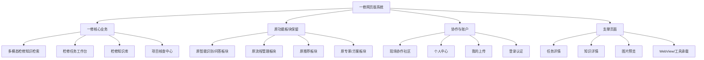
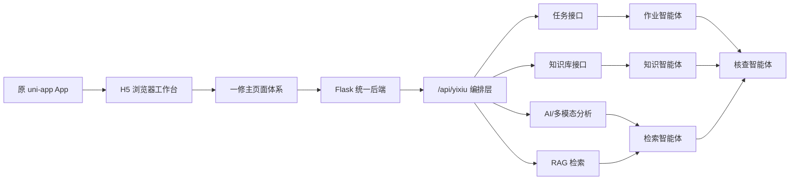

# 原 App 功能板块与一修网页版重构设计说明

## 1. 文档目的

本文用于说明原 App 各功能板块的职责、保留方式，以及将项目重构为“一修”网页版后的页面设计、技术路线和功能分级结构。

本次重构目标不是简单改名，而是在保留原有 uni-app 前端、Flask 后端、页面路由、任务接口、知识接口和 AI 能力的基础上，把原来偏移动端 App 的交互方式，重新组织为适合浏览器访问的设备检修知识检索与作业系统。

## 2. 原 App 功能板块梳理

| 原功能板块 | 主要页面 | 原有职责 | 一修中的保留方式 |
| --- | --- | --- | --- |
| 首页入口 | `pages/home/home.vue` | 原系统总入口、功能聚合、数据概览 | 重构为一修网页版工作台首页，展示技术路线、分级板块图、任务状态和核心入口 |
| 智能识别/问答 | `pages/takeaway-expert/takeaway-expert.vue` | 原智能识别、问答、分析类入口 | 保留为历史智能能力入口，并迁移语义为多模态检修知识检索来源 |
| 流程/任务管理 | `pages/health-manager/health-manager.vue` | 原多标签流程管理、记录、任务流转 | 保留为旧流程管理入口，并升级为检修任务、SOP、风险闭环的参考板块 |
| 推荐板块 | `pages/restaurant-recommendation/restaurant-recommendation.vue` | 原推荐列表、方案推荐、筛选展示 | 保留为推荐能力入口，迁移为检修方案推荐和知识匹配来源 |
| 方案/专家板块 | `pages/recipe-recommendation/recipe-recommendation.vue`、`pages/cooking-expert/cooking-expert.vue` | 原方案生成、专家辅助、资源推荐 | 保留为专家辅助入口，后续可改造成检修专家助手和方案生成器 |
| 社区协作 | `pages/nearby-communities/nearby-communities.vue`、`pages/community-detail/community-detail.vue` | 原社区列表、社区详情、讨论互动 | 保留为现场协作、经验交流、专家支援板块 |
| 个人中心 | `pages/personal-center/personal-center.vue` | 用户资料、操作入口、个人数据 | 保留为账号中心和检修人员工作台入口 |
| 资料维护 | `pages/personal-center/profile-edit.vue`、`achievements.vue`、`initial-setup.vue`、`my-uploads.vue` | 资料编辑、成果展示、初始化配置、上传记录 | 保留为人员资料、成果、现场图片和案例上传记录 |
| 登录认证 | `pages/user/login.vue` | 用户登录和会话入口 | 保留为系统认证支撑页面 |
| 任务详情 | `pages/task-detail/task-detail.vue` | 任务详情、操作记录、状态展示 | 保留为检修工单详情承载页 |
| 知识详情 | `pages/knowledge-detail/knowledge-detail.vue` | 知识条目详情展示 | 保留为维修手册、案例、图谱节点详情页 |
| 工具承载页 | `pages/openclaw/openclaw.vue`、`pages/webview/webview.vue`、`pages/image-viewer/image-viewer.vue` | 外部工具、网页承载、图片预览 | 保留为系统支撑能力 |

## 3. 一修新版主功能板块

新版“一修”主导航保留 5 个网页入口：

| 新版入口 | 页面 | 职责 |
| --- | --- | --- |
| 首页 | `pages/home/home.vue` | 浏览器式总控台，展示平台定位、技术路线、分级板块图、任务摘要和原板块迁移关系 |
| 检索 | `pages/repair-search/repair-search.vue` | 多模态检修知识检索，支持故障文本、图片、设备型号、维修手册和案例召回 |
| 任务 | `pages/repair-tasks/repair-tasks.vue` | 检修任务工作台，展示工单、风险、SOP、状态和复测闭环 |
| 知识 | `pages/knowledge-base/knowledge-base.vue` | 检修知识库，沉淀手册条款、故障案例、标准流程和图谱关系 |
| 我的 | `pages/yixiu-profile/yixiu-profile.vue` | 项目核查中心，展示多智能体分工、核查清单、质量分和交付状态 |

## 4. 功能分级板块图

## 5. 页面设计重构方案

### 5.1 设计方向

新版页面设计定位为“浏览器式检修工作台”，重点从移动端 App 的单列页面，转为桌面端 Web 系统的信息架构。

设计关键词：

- 浏览器外壳：顶部地址栏、系统状态、快捷操作。
- 工作台布局：左侧分组导航，中间主内容，右侧任务与核查信息。
- 高密度信息：减少营销式大卡片，增加表格、分组、层级、状态和入口。
- 原板块可追溯：原 App 功能不删除，统一放入“原功能板块/迁移板块”中。
- A1 赛题聚焦：突出多模态检索、检修作业、知识沉淀、多智能体和核查闭环。

### 5.2 首页设计

首页承担系统总控台职责，建议分为 6 个区域：

1. 顶部浏览器栏：展示“一修”、系统路径、检索和核查快捷入口。
2. 左侧分组导航：按“一修核心业务、原功能板块、协作与账户、支撑页面”组织入口。
3. 技术路线区：说明从前端、接口、智能体、知识库到验收的实现链路。
4. 分级板块图区：用层级结构展示原功能如何拆分并迁移到一修。
5. 原板块迁移清单：列出每个旧页面、保留原因和迁移方向。
6. 今日任务与智能体区：展示检修任务、风险状态和智能体职责。

### 5.3 主页面设计

| 页面 | 设计方向 |
| --- | --- |
| 检索页 | 改成检修资料检索台，左侧输入故障、图片、型号，右侧展示手册、案例、SOP、风险提醒 |
| 任务页 | 改成工单看板，支持按风险、状态、设备类型筛选，突出当前处理步骤 |
| 知识库页 | 改成资料库/知识图谱视图，区分手册、案例、问答、规则、图谱节点 |
| 核查中心 | 改成项目验收面板，展示多智能体分工、A1 对齐度、质量核查和演示清单 |
| 原功能页 | 保留原页面入口，后续逐步替换旧业务词和旧交互，但不影响新版主流程 |

## 6. 技术路线重构

技术路线分为 5 层：

| 层级 | 技术方案 | 说明 |
| --- | --- | --- |
| 表现层 | uni-app Vue3 H5 | 保留现有前端工程，主目标切换为浏览器访问 |
| 页面层 | 首页、检索、任务、知识、核查、原板块入口 | 重新组织为 Web 工作台结构 |
| 编排层 | Flask `/api/yixiu` | 聚合概览、检索、任务、知识、智能体、核查接口 |
| 能力层 | AI 服务、RAG、知识库、任务服务 | 复用原有后端能力，并迁移到设备检修语义 |
| 验收层 | 构建检查、接口检查、浏览器检查、核查清单 | 支撑比赛演示和项目交付 |

## 7. 多智能体分工设计

| 智能体 | 职责 | 对应页面/接口 |
| --- | --- | --- |
| 检索智能体 | 解析故障描述、图片和设备型号，召回手册、案例和 SOP | 检索页、`/api/yixiu/search` |
| 作业智能体 | 将检索结果编排成现场作业步骤和安全提醒 | 任务页、`/api/yixiu/tasks` |
| 知识智能体 | 审核现场案例，沉淀知识条目和图谱关系 | 知识库页、`/api/yixiu/knowledge` |
| 协作智能体 | 支撑负责人、专家和一线人员沟通 | 社区页、任务页 |
| 核查智能体 | 复核引用依据、作业完整性、安全风险和报告质量 | 核查中心、`/api/yixiu/audit` |

## 8. 路由保留策略

底部主导航只放新版“一修”主流程：

- 首页
- 检索
- 任务
- 知识
- 我的/核查

原 App 页面继续注册到 `pages.json`，但作为二级入口从首页分级板块进入。这样既能保留原有功能，又能避免评审进入系统时看到旧业务结构混在主流程中。

## 9. 后续页面重构建议

1. 将 `takeaway-expert` 页面旧业务词替换为“检修识别/故障问答”。
2. 将 `restaurant-recommendation` 页面改造成“检修方案推荐/知识推荐”。
3. 将 `recipe-recommendation` 和 `cooking-expert` 合并为“检修专家方案生成”。
4. 将 `health-manager` 的标签和字段统一迁移为“工单、风险、SOP、验收、报告”。
5. 将个人中心的数据名称改为“检修记录、上传案例、审核成果、知识贡献”。
6. 保留 `task-detail`、`knowledge-detail`、`webview` 等支撑页，但统一页面标题和字段语义。

## 10. 完成标准

- 首页能清楚展示原 App 功能板块和新版一修主流程。
- 原页面入口可追溯、可访问，不破坏原架构。
- 新版主导航符合浏览器端系统使用习惯。
- 技术路线能解释前端、后端、AI/RAG、知识库和多智能体如何协同。
- 页面设计能体现中国软件杯 A1 赛题：多模态大模型、设备检修、知识检索、作业系统、智能体核查。
